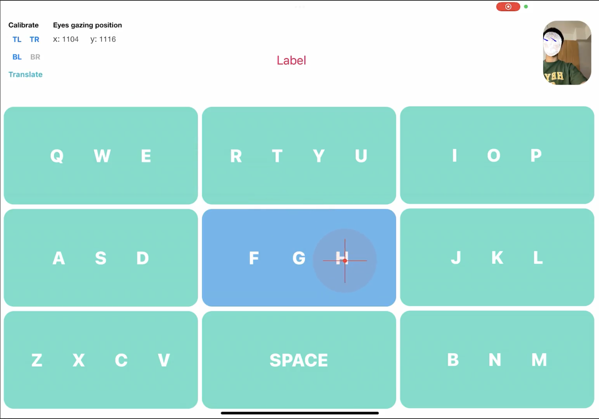
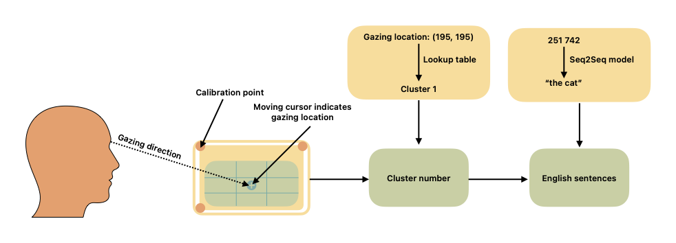

# Touchless Typing Training

Training code for translating eye-gaze location clusters to English words using a fine-tuned seq2seq model (facebook/bart-large).

Eye-gaze locations are recorded using ARKit. The UI presents a standard QWERTY keyboard divided into clusters (groups of nearby keys). After the user fixates on a cluster for a threshold duration, that cluster is recorded as a digit. When the space key is detected, the accumulated cluster sequence is sent for inference, translating it back into English text.

The ARKit app can be found [here](https://github.com/hungngo04/TouchlessTyping)





## How It Works

The QWERTY keyboard is divided into spatial regions. Each key maps to a cluster digit:

```
9 clusters (default):
  [q w e] → 1    [r t y u] → 2    [i o p] → 3
  [a s d] → 4    [f g h]   → 5    [j k l] → 6
  [z x c v] → 7               [b n m] → 9
```

For example, "hello" → `51663`, "how are you" → `531 421 232`.

A BART model is then fine-tuned to translate these cluster sequences back into English.

## Setup

```bash
pip install -r requirements.txt
```

## Usage

**1. Prepare the dataset** — convert English text into cluster sequences:

```bash
python train.py prepare --input eng-fra-original.csv --clusters 9
```

**2. Train the model:**

```bash
python train.py train --model facebook/bart-large --fp16 --epochs 4
```

**3. Run inference:**

```bash
python train.py infer --model hungngo04/cluster_to_text_t5_base --text "51663 531 421"
```

## Cluster Configurations

| Clusters | Grouping |
|----------|----------|
| 9 | qwe / rtyu / iop / asd / fgh / jkl / zxcv / bnm |
| 7 | qwert / yuiop / asdfg / hjkl / zxc / vbnm |
| 5 | qweasdz / rtfgxc / yuhjvb / iopklnm |
| 3 | qwertasdfgzxc / yuiophjklvbnm |

Fewer clusters = coarser input = harder translation task, but more tolerant of gaze imprecision.
